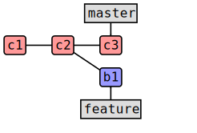
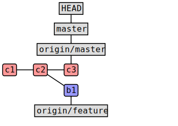
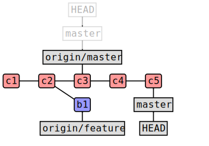
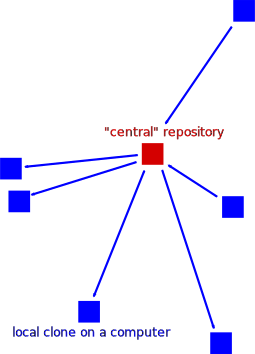
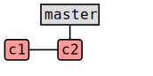
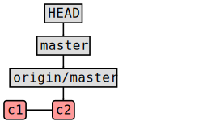
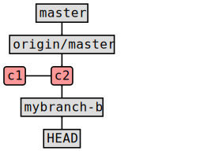
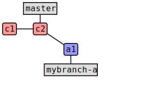
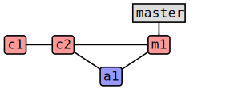
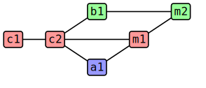

name: inverse
layout: true
class: middle, inverse

---

# Forking workflow demo

## [Radovan Bast](http://bast.fr)

### [NeIC](https://neic.nordforsk.org)/ [UiT The Arctic University of Norway](https://uit.no)

Text is free to share and remix under [CC-BY-SA-4.0](https://creativecommons.org/licenses/by-sa/4.0/).

---

layout: false

## .blue[Goals]

### First some nomenclature

### Then we do an exercise

---

## Commits and branches

- Commits are snapshots
- Commits form a graph (directed acyclic graph)
- A branch is a pointer to a commit
- A tag is a pointer to a commit
- Repository is the commit tree with branches and tags

---

## What happens when we clone?

Remote:

Local clone:

---

## Local work

Remote:

Local clone:

---

class: split-50-50

## Centralized vs. distributed

.column[

]

.column[

]

- Pull request or merge request: code review
- Code review can happen within one repository between branches

---

## What to look for when reviewing code

- Is the commit message descriptive?
- Does it describe why something was done?
- Does it preserve the test set?
- Does the code arrive with own test(s)?
- Does the code arrive with documentation?
- Is it submitted to the right branch?
- Contributor remembered to add a changelog entry?
- Is this a bugfix? If yes, auto-closing issue?

### .blue[Code review is not a police state. It is a learning opportunity.]

---

## Code review is an investment

- Code review takes time both for the contributor and the reviewer
- Already modest investment in time gets you far

## Release preparation

- Everything accepted on central master branch is scheduled for the next release
- No code removal before release

If we have automated testing coupled with code review and do a good job at the code review stage
there is not much to do for the release:

- Agree on release date and feature freeze
- Inform people
- Branch off e.g. 1 month before release
- Minor clean-up in documentation, tests
- At release: create tag
- Create a DOI
- Update website

---

## Value of issues

If you are not sure whether your idea will be accepted as merge request 1 year
later, describe what you plan to do in an issue (proposal) and discuss the
change before you invest coding time.

---

## .blue[Exercise]

### - Fork a project (we will modify the Dalton website)

### - Make a modification (fix e.g. the link to your homepage or fix a typo)

### - Submit a merge request

### - Observe how merge requests are discussed and integrated

### - Update your fork with changes submitted by others

---

class: split-50-50

### 0) We start with a central repository

---

class: split-50-50

### 1) We fork the repository

.column[
Fork A:

]

.column[
Fork B:

]

---

class: split-50-50

### 2) Then we clone

.column[
Fork A:

Local clone A:

]

.column[
Fork B:

Local clone B:

]

---

class: split-50-50

### 3) Create a branch, never work on master

.column[
Fork A:

Local clone A:

]

.column[
Fork B:

Local clone B:

]

---

(for simplicity we ignore HEAD and origin/master in the following)

---

class: split-50-50

### 4) Make a local modification

.column[
Fork A:

Local clone A:

]

.column[
Fork B:

Local clone B:

]

---

class: split-50-50

### 5) Push to your fork and submit merge request towards master

.column[
Fork A:

Local clone A:

]

.column[
Fork B:

Local clone B:

]

---

class: split-50-50

### 6) Accept merge request from fork A

.column[
Fork A:

]

.column[
Fork B:

]

---

class: split-50-50

### 7) Accept merge request from fork B

.column[
Fork A:

]

.column[
Fork B:

]

---

class: split-50-50

### 8) Update local clones

.column[
Fork A:

Local clone A:

]

.column[
Fork B:

Local clone B:

]

---

class: split-50-50

### 9) Update master branches on forks

.column[
Fork A:

Local clone A:

]

.column[
Fork B:

Local clone B:

]

---

## Never work on the master branch

- Merge requests are from a source branch to a target branch, not from a certain commit
- New commits to a source branch are appended to the merge request
- Always create a new branch for a new change
- Otherwise you cannot have more than one merge request open
- Consider master read-only
- Then updating master branch can never conflict
- Reviewer may choose to squash or rebase - if you work on the master branch you may involuntarily re-submit
  commits from others

---

## Remarks

- You can mark branch for deletion upon acceptance
- You can choose to squash commits
- You may be asked to rebase your commits
